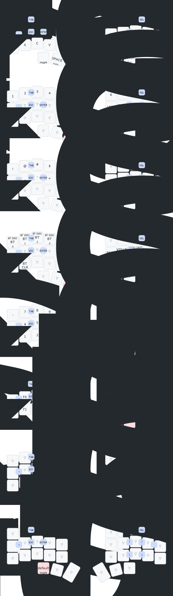

# zmk-config

This is my personal [ZMK firmware](https://github.com/zmkfirmware/zmk/)
configuration. It is based on
[urob's zmk-config](https://github.com/urob/zmk-config)

## Highlights

- Auto-toggle off numbers and mouse layers
- Magic thumb quadrupling as Repeat/Sticky-shift/Capsword/Shift
- Leader key sequences for Unicode input and system commands
- Fully automated, nix-powered
  [local build environment](#local-build-environment)



### Troubleshooting

Hopefully, the above configuration "just works". If it doesn't, here's a few
smaller (and larger) things to try.

- **Noticeable delay when tapping HRMs:** Increase `require-prior-idle-ms`. As a
  rule of thumb, you want to set it to at least `10500/x` where `x` is your
  (relaxed) WPM for English prose.[^3]
- **False negatives (same-hand):** Reduce `tapping-term-ms` (or disable
  `hold-trigger-key-positions`)
- **False negatives (cross-hand):** Reduce `require-prior-idle-ms` (or set
  flavor to `hold-preferred` -- to continue using `hold-trigger-on-release`, you
  must apply this
  [patch](https://github.com/celejewski/zmk/commit/d7a8482712d87963e59b74238667346221199293)
  to ZMK
- **False positives (same-hand):** Increase `tapping-term-ms`
- **False positives (cross-hand):** Increase `require-prior-idle-ms` (or set
  flavor to `tap-preferred`, which requires holding HRMs past tapping term to
  activate)

## Smart layers and other gimmicks

##### Numword

Inspired by Jonas Hietala's
[Numword](https://www.jonashietala.se/blog/2021/06/03/the-t-34-keyboard-layout/#where-are-the-digits)
for QMK, I implemented my own
[Auto-layer behavior](https://github.com/urob/zmk-auto-layer) for ZMK to set up
Numword. It is triggered via a single tap on "Smart-Num". Numword continues to
be activated as long as I type numbers, and deactivates automatically on any
other keypress (holding it activates a non-sticky num layer).

After using Numword for more than a year now, I have been overall very happy
with it. When typing single digits, it effectively is a sticky-layer but with
the added advantage that I can also use it to type multiple digits.

The main downside is that if a sequence of numbers is _immediately_ followed by
any of the letters on which my numpad is located (WFPRSTXCD), then the automatic
deactivation won't work. But this is rare -- most number sequences are
terminated by `space`, `return` or some form of punctuation/delimination. To
deal with the rare cases where they aren't, there is a `CANCEL` key on the
navigation-layer that deactivates Numword, Capsword and Smart-mouse. (It also
toggles off when pressing `Numword` again, but I find it cognitively easier to
have a dedicated "off-switch" than keeping track of which modes are currently
active.)

##### Smart-Mouse

Similarly to Numword, I have a smart-mouse layer (activated by comboing
<kbd>W</kbd> + <kbd>P</kbd>), which replaces the navigation cluster with scroll
and mouse-movements, and replaces the right thumbs with mouse buttons. Pressing
any other key automatically deactivates the layer.

##### Magic Repeat/Shift/Capsword

My right thumb triggers three variations of shift as well as repeat: Tapping
after any alpha key yields key-repeat (to reduce SFUs). Tapping after any other
keycode yields sticky-shift (used to capitalize alphas). Holding activates a
regular shift, and double-tapping (or equivalently shift + tap) activates ZMK's
Caps-word behavior.

One minor technical detail: While it would be possible to implement the
double-tap functionality as a tap-dance, this would add a delay when using
single taps. To avoid the delays, I instead implemented the double-tap
functionality as a mod-morph.

##### Multi-purpose Navigation cluster

To economize on keys, I am using hold-taps on my navigation cluster, which yield
`home`, `end`, `begin/end of document`, and `delete word forward/backward` on
long-presses. The exact implementation is tweaked so that `Ctrl` is silently
absorbed in combination with `home` and `end` to avoid accidental document-wide
operations (which are accessible via the dedicated `begin/end document keys`.)

##### Swapper

I am using [Nick Conway](https://github.com/nickconway)'s fantastic
[tri-state](https://github.com/zmkfirmware/zmk/pull/1366) behavior for a
one-handed Alt-Tab switcher (`PWin` and `NWin`).

##### Leader key

I am using my own implementation of a
[Leader key](https://github.com/urob/zmk-leader-key) (activated by comboing
<kbd>S</kbd> + <kbd>T</kbd>) to bind various behaviors to my layout without
reserving dedicated keys. Currently, I am using them to bind German Umlauts,
Greek letters for math usage, and various system commands (e.g., to toggle
Bluetooth). See
[`leader.dtsi`](https://github.com/urob/zmk-config/blob/main/config/leader.dtsi)
for the full list of leader key sequences.

## Local build environment

I streamline my local build process using `nix`, `direnv` and `just`. This
automatically sets up a virtual development environment with `west`, the
`zephyr-sdk` and all its dependencies when `cd`-ing into the ZMK-workspace. The
environment is _completely isolated_ and won't pollute your system.

### Setup

#### Pre-requisites

1. Install the `nix` package manager:

   ```bash
   # Install Nix with flake support enabled
   curl --proto '=https' --tlsv1.2 -sSf -L https://install.determinate.systems/nix |
      sh -s -- install --no-confirm

   # Start the nix daemon without restarting the shell
   . /nix/var/nix/profiles/default/etc/profile.d/nix-daemon.sh
   ```

2. Install [`direnv`](https://direnv.net/) (and optionally but recommended
   [`nix-direnv`](https://github.com/nix-community/nix-direnv)[^4]) using your
   package manager of choice. E.g., using the `nix` package manager that we just
   installed[^5]:

   ```
   nix profile install nixpkgs#direnv nixpkgs#nix-direnv
   ```

3. Set up the `direnv` [shell-hook](https://direnv.net/docs/hook.html) for your
   shell. E.g., for `bash`:

   ```bash
   # Install the shell-hook
   echo 'eval "$(direnv hook bash)"' >> ~/.bashrc

   # Enable nix-direnv (if installed in the previous step)
   mkdir -p ~/.config/direnv
   echo 'source $HOME/.nix-profile/share/nix-direnv/direnvrc' >> ~/.config/direnv/direnvrc

   # Optional: make direnv less verbose
   echo '[global]\nwarn_timeout = "2m"\nhide_env_diff = true' >> ~/.config/direnv/direnv.toml

   # Source the bashrc to activate the hook (or start a new shell)
   source ~/.bashrc
   ```

#### Set up the workspace

1. Clone _your fork_ of this repository. I like to name my local clone
   `zmk-workspace` as it will be the toplevel of the development environment.

   ```bash
   # Replace `urob` with your username
   git clone https://github.com/urob/zmk-config zmk-workspace
   ```

2. Enter the workspace and set up the environment.

   ```bash
   # The first time you enter the workspace, you will be prompted to allow direnv
   cd zmk-workspace

   # Allow direnv for the workspace, which will set up the environment (this takes a while)
   direnv allow

   # Initialize the Zephyr workspace and pull in the ZMK dependencies
   # (same as `west init -l config && west update && west zephyr-export`)
   just init
   ```

### Usage

After following the steps above your workspace should look like this:

```
zmk-workspace
├── config
├── firmware (created after building)
├── modules
├── zephyr
└── zmk
```

#### Building the firmware

To build the firmware, simply type `just build all` from anywhere in the
workspace. This will parse `build.yaml` and build the firmware for all board and
shield combinations listed there.

To only build the firmware for a specific target, use `just build <target>`.
This will build the firmware for all matching board and shield combinations. For
instance, to build the firmware for my Corneish Zen, I can type
`just build zen`, which builds both `corneish_zen_v2_left` and
`corneish_zen_v2_right`. (`just list` shows all valid build targets.)

Additional arguments to `just build` are passed on to `west`. For instance, a
pristine build can be triggered with `just build all -p`.

(For this particular example, there is also a `just clean` recipe, which clears
the build cache. To list all available recipes, type `just`. Bonus tip: `just`
provides
[completion scripts](https://github.com/casey/just?tab=readme-ov-file#shell-completion-scripts)
for many shells.)

#### Drawing the keymap

The build environment packages
[keymap-drawer](https://github.com/caksoylar/keymap-drawer). `just draw` parses
`base.keymap` and draws it to `draw/base.svg`.

#### Hacking the firmware

To make changes to the ZMK source or any of the modules, simply edit the files
or use `git` to pull in changes.

To switch to any remote branches or tags, use `git fetch` inside a module
directory to make the remote refs locally available. Then switch to the desired
branch with `git checkout <branch>` as usual. You may also want to register
additional remotes to work with or consider making them the default in
`config/west.yml`.

#### Updating the build environment

To update the ZMK dependencies, use `just update`. This will pull in the latest
version of ZMK and all modules specified in `config/west.yml`. Make sure to
commit and push all local changes you have made to ZMK and the modules before
running this command, as this will overwrite them.

To upgrade the Zephyr SDK and Python build dependencies, use `just upgrade-sdk`.
(Use with care -- Running this will upgrade all Nix packages and may end up
breaking the build environment. When in doubt, I recommend keeping the
environment pinned to `flake.lock`, which is
[continuously tested](https://github.com/urob/zmk-config/actions/workflows/test-build-env.yml)
on all systems.)
